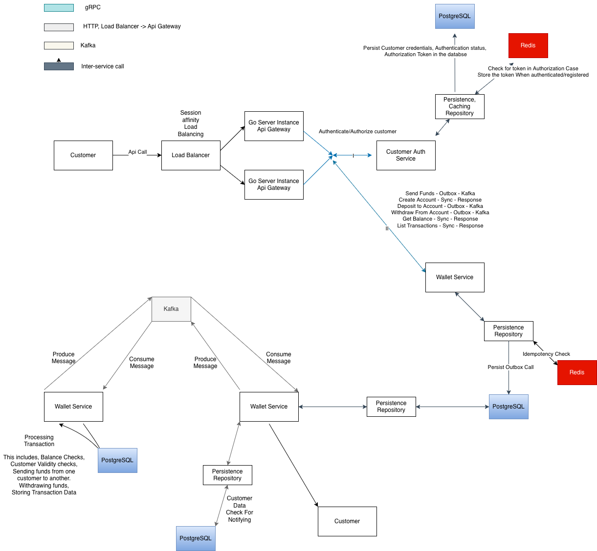

## Fully Fledged Wallet/Ledger application implemented in Go

### Project Description

The original project description was to build double entry wallet/ledger with two direction ledger meaning each transfer would cause two writes. This actual built wallet service is a bit different. In the above mentioned case we don't have any centralized balance. The only way that the balance operations are possible is through reconciliations - ledger writes by the account. Same way blockchain is structured.

This variant does mimic that. Although with the current setup we do have centralized balance per account being in minor units. That said every financial operation is performed via reconciliation which is indexed and fast without almost any increased latency.

The Project structure is also deviated from the purposed setup which offered adapter pattern to be used for functionality to be injected. Instead of this we used dedicated microservices (Tho that wasn't prohibited by the setup). One of the microservices is completely redundant auth-service. But for the sake of this application i found it fitting to have another service which could authenticate the user before creating an account. There is also one a bit bloated at this point wallet-service which combines each of the functionalities as being a ledger - recording transactions. as well as creating accounts and the whole asynchronous functionality of this application is completely driven by this service.

There are also couple of things missing and couple of improvement we can do. For example: Consumer listener running on single goroutine while having partitions. bloated service offloading via shared structure. Some duplications that can be simplified, sentinel error handling for financial operations. Also the list transactions operations via gRPC hasn't been implemented yet, the Wallet Service repository is bloated not split into other services respective repositories. gRPC not properly versioned for backward compatibility and etc. Most of this because of a time constraint. But the majority of functionality has been implemented.

### Architecture

To see the diagram of the architecture see 

Project uses microservice architecture where each service is structured hexagonally having in/outbound adapters. There is no usage of adapter pattern in traditional sense. But we have a structure similar to that we have shared functionality with commonly used modules in every service in [Shared Functionality](./shared) folder.

#### Api Gateway
First we have a single point of entry via the first service api-gateway. meaning other services are not accessible externally. api-gateway service has two adapters one inbound adapter http with declared routes and controllers handling the serving to service layer which is basically a second layer used to invoke the other internal service via it's outbound adapter gRPC client.

#### Auth Service

auth-service exposes gRPC endpoint on it's port. Does idempotency check on the user and has access to two db tables that is user_auth for user session management and user itself for authentication and user registering. first service to use repository pattern. with two outbound adapters to Cache - redis and DB - postgreSQL. In each case we check for idempotency the DB is provided as fallback. This service is fully synchronous.

#### Wallet Service

The biggest service we have so far is the wallet-service which provides multiple functionality it has one inbound and three outbound adapters. One inbound again being gRPC which serves as synchronous and asynchronous contact point between gateway and itself. Some of the gRPC methods structured by their sync or async nature includes:
  Sync: CreateAccount, GetBalance, ListTransactions
  Async: Deposit, Withdraw, Transfer
  Streamed: StreamTransactions (Not implemented)

  The Synchronous operations do not involve DB transactions, They always read Committed values, or cached as well as basic default service level and DB level checks ar sufficient for those operations

  While the Asynchronous operations are complex involve multiple layers of dependency, Transactional access to the db. Reconciliation upon every call, idempotency checks, Outbox write reads. and dedicated threads allocated to those operations. That is why the response is returned immediately and processed via outbox, event streamer 
        

#### Scripts

Two distinct script services

*Migration* service that runs one time on bootstrap applies the latest migrations and then exits with code 0

*Topic-Init* service that runs the kafka configuration applying script. Which defines the topics their respective partitions counts. and dial timeout in case Kafka is not healthy yet. Also exits with code 0 upon successfully applying the config, or in case duplicate config also exits with code 0.


#### Shared

Shared functionality includes adapters for:
 1. DB initialization and connection. as well as pool and close connection call. Swappable implementation applicable to other DBs
 2. Cache initialization and operation layer. connect, close operations as well as actual cache operations like idempotency, balance read-through and etc.
 3. Environment variable retrieval with type inference.
 4. Event handling (In this case for kafka) provides default contract for event streaming/message brokering operations
 5. Centralized logging lib which also can be extendable to other concrete implementations - uses log slog and custom identifier injection through context
 6. Migrations for centralized db state management with up and down scripts.
 7. Pkg for shared domain/model/mapping/session management. shared across all services
 8. Proto for gRPC protocol buffers and translated go code.
 9. Retry for shared retry with backoff functionality which provide context agnostic implementation
 
    

#### Tech Stack

*Go* - version 1.26.4

*Go Redis Client redis/go-redis/v9* - version 9.22.0

*Redis(Docker)* - version redis:7-alpine

*Apache Kafka(Docker)* - version kafka:latest

*Go Kafka Client - segmentio/kafka-go* - version 0.4.51

*PostgreSQL(Docker)* - postgres:latest/16+

*Migrations* - pressly/goose/v3 version 3.27.3

*Go gRPC Client* - google.golang.org/grpc version 1.83.0

*golang-jwt/jwt/v5* - version 5.3.1

*testcontainers-go* - version 0.44.0

*Docker* - local version

*Docker-Compose* - local version

*air* - local version(for reload on change)

Other smaller dependencies


### Project Structure

Project structure is directly presented in the 
- Diagram
- [Go Wallet Service Architecture](.go_wallet_service.drawio.png) 
 This is a high level overview and doesn't show inter-service structure but high level project structure is well depicted in here

### Prerequisites

- Docker + Docker Compose
- Go 1.26.4 (local dev, tests, builds)
- goose CLI (local migrations — go install github.com/pressly/goose/v3/cmd/goose@latest)
- make
- protoc + protoc-gen-go + protoc-gen-go-grpc (only if regenerating proto code)
- air (only for make dev hot-reload)
- Docker daemon running (required even for integration tests, via testcontainers-go)


### Getting Started

Development mode (hot reload — infra in Docker, app code on host via air):
  - Running third party and related services, with their UIs
  ```bash
    docker compose --profile dev up -d db redis kafka migrate topic-init kafka-ui grpcui-auth grpcui-wallet redisinsight
  ```
  - Running our microservices locally
  ```bash
    make dev
  ``` 
  - Running everything in docker with development mode
  ```bash
    docker compose --profile dev up -d 
  ```
  

#### Environment Variables

No need to explicitly inject and insert variables in the project if run with docker

### Database Migrations

Locally can be run with command *make migrateup* or in case new migration needs to be generate with command *make createNewMigration* and then *make migrateup*

With docker compose the relevant script that applies migrations will run automatically if dependant services are healthy view [Migration Service](./scripts/migrations)

### Testing

#### Unit Tests
Business logic and mapping layers tested against fakes (`fixtures.Fake*`) — no real Postgres, Redis, or Kafka.

- **api-gateway** — request validation, proto↔domain mapping, and every service method (user register/login, account create, deposit/withdraw/transfer/balance/list), including the gRPC-error passthrough path for each.
- **auth-service** — input validation, bcrypt password hashing, proto↔domain mapping, and the full login/register flow — duplicate users, wrong password, and the "already logged in" session guard.
- **wallet-service** — proto↔domain mapping, the outbox relay's publish/retry/backoff branches, event dispatcher routing, account-opening rules, balance lookups, and the deposit/withdraw/transfer event handlers (including the withdrawal high-balance guard and insufficient-balance short-circuit).

#### Integration Tests
Run against real Postgres and Redis via `testcontainers-go`, migrations applied fresh per test through goose; api-gateway additionally uses in-process `bufconn` gRPC servers standing in for auth-service/wallet-service.

- **api-gateway** — full HTTP flows through the gateway for registration, login, account creation, and every wallet operation, plus a complete register → create-account → deposit happy path.
- **auth-service** — repository round-trips for users/tokens, and concurrency cases: duplicate-username races, concurrent token upserts, double-login guard under simultaneous requests.
- **wallet-service** — the largest suite: repository-level money movement (deposit/withdraw/transfer, redelivery idempotency, insufficient-balance rollback), the outbox pipeline (insert/claim/update/delete, publish-failure backoff), and three dedicated concurrency tests — no deadlock on opposing concurrent transfers, no overdraft under concurrent withdrawals, no double-delivery from concurrent outbox pollers.

#### gRPC Services

  #### AuthService (`shared/proto/auth.proto`)
- `RegisterUser(RegisterUserRequest) → RegisterUserResponse` — creates a new user, returns an access token
- `LoginUser(LoginUserRequest) → LoginUserResponse` — authenticates username/password, returns an access token
- `RefreshToken(RefreshTokenRequest) → RefreshTokenResponse` — exchanges a refresh token for a new session

#### WalletService (`shared/proto/wallet.proto`)
- `CreateAccount(CreateAccountRequest) → CreateAccountResponse` — opens a new account for a user in a given currency
- `GetBalance(GetBalanceRequest) → GetBalanceResponse` — returns an account's current balance and currency
- `Deposit(DepositRequest) → DepositResponse` — queues a deposit; returns immediately with a pending transaction, settled asynchronously
- `Withdraw(WithdrawRequest) → WithdrawResponse` — queues a withdrawal; same async pending/settle pattern as Deposit
- `Transfer(TransferRequest) → TransferResponse` — queues a transfer between two accounts; same async pattern
- `ListTransactions(ListTransactionsRequest) → ListTransactionsResponse` — paginated transaction history for an account
- `StreamTransactions(StreamTransactionsRequest) → stream Transaction` — server-streaming RPC; declared in the proto but **not yet implemented** (returns "Method not yet implemented")

#### REST Endpoints (API Gateway)

#### User
| Method | Path | Body | Notes |
|---|---|---|---|
| POST | `/user/register` | `{name, username, email, password}` | Returns `{status, acccess_token}` |
| POST | `/user/login` | `{username, password}` | Returns `{status, acccess_token}` |
| POST | `/user/refresh` | `{refresh_token}` | Returns `{token}` |

#### Account
| Method | Path | Query | Body | Notes |
|---|---|---|---|---|
| POST | `/account/create` | `?userId=` | `{currency}` | Returns `{status, account_id, balance, currency}` |
| UPDATE | `/account/update` | `?userId=` | `{account_id, owner_account_id}` | **Not yet implemented** — underlying service returns a stub |

#### Wallet
| Method | Path | Query | Body | Notes |
|---|---|---|---|---|
| POST | `/wallet/deposit` | `?userId=` | `{account_id, currency, amount}` | Async — returns a `pending` transaction immediately, settles later |
| POST | `/wallet/withdraw` | `?userId=` | `{account_id, amount}` | Async, same pattern as deposit |
| POST | `/wallet/transfer` | `?userId=` | `{from_account_id, to_account_id, currency, amount}` | Async, same pattern |
| GET | `/wallet/balance` | `?userId=&accountId=` | — | Returns `{account_id, balance, currency}` |
| GET | `/wallet/transactions` | `?accountId=&page=&pageSize=` | — | Paginated;

#### Health
| Method | Path | Notes |
|---|---|---|
| GET | `/health/liveness` | No auth required |
| GET | `/health/readiness` | No auth required |

### CI

Currently we only have CI, Which launches Unit, Integration and Container tests. And then the project just builds, After that merge on main branch is made
In case no failure occurs.

### Known Limitations

There are few limitations/improvements:
 - Firstly There's no load balancer implementation. The app does fully supports horizontal scaling but on higher loads. as mentioned in the diagram.
 - There's unimplemented functionality like transaction streaming, updateAccount functionality, No recovery in case consume part of the Kafka goes wrong (Outbox part is covered and reconciled) - consuming exception causes failure and skipped iteration without a retry, No Rate-limit interceptor in Redis.
 - There's code duplication in couple of parts
 - Consuming service running on a single thread and processing one message at a time. This limits to around 20 consumed jobs in a second instead of much higher throughput with multiple goroutines allocated to it. having three partitions kind of loose purpose like that. to handle the throughput of 500 RPS would be much better to have proportional amount of threads/goroutines allocated to consuming and processing messages as we have partitions
 - gRPC versioning for backwards compatibility we should have a versioning separation for the protobufs.
 - The Current reconciliation operation can become expensive at scale. Current setup isn't meant for the account with high amount of transactions. At scale should be moved to snapshot reconciliation every so often.
 - As mentioned in the docs cursor pagination also is a better option at scale
 - User session management remains not fully implemented as well as session refresh
 - Overall the double entry ledger is a more robust approach but at a smaller scale this will work fine.